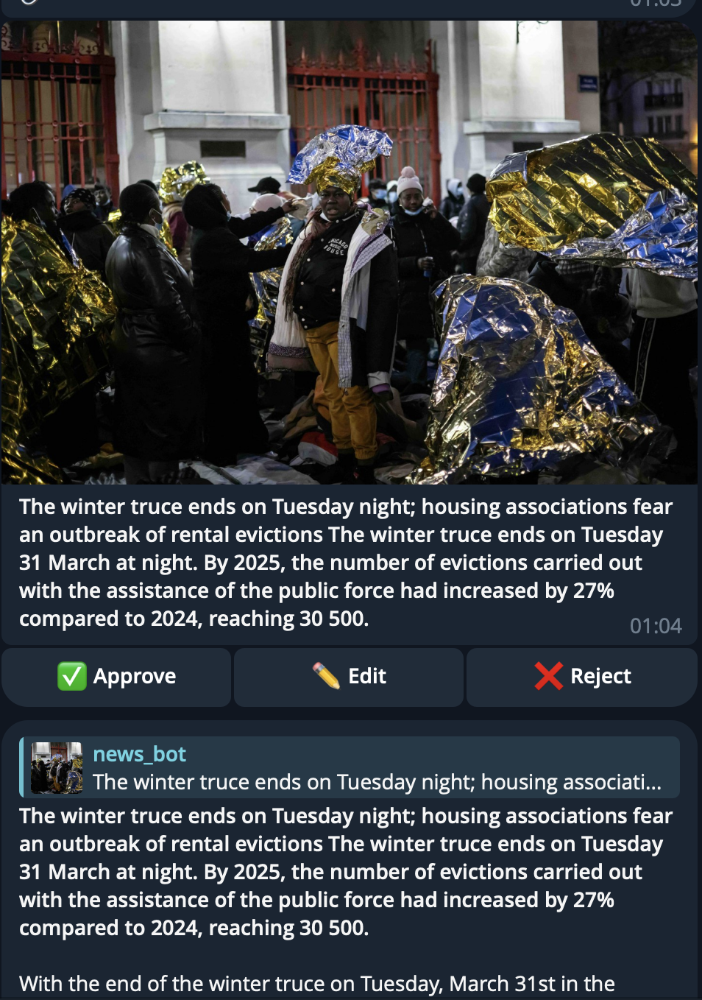

# 📰 News Parser & Telegram Workflow

<p align="center">
  
</p>

**A lightweight Python toolkit to scrape articles from Le Monde’s “actualité en continu”, translate/paraphrase them, and send approved items to a Telegram channel.** 💬✨

---

## 📌 What This Does

This repository includes a set of small scripts that:

- 🔎 **Scrape today's articles** from Le Monde’s continuously updated news feed  
- 🧠 **Translate & paraphrase text** into English (optional)  
- 📲 **Send approved paraphrased news** to your Telegram channel via an approval workflow  
- 🛠️ Works with SQLite for storing articles & translations  

➡️ Perfect for building news bots, automated digest channels, or custom content pipelines.

---

## 🚀 Features

✨ **Main Highlights**

- 🗞️ Fetches fresh articles from Le Monde  
- 🔁 Translation + paraphrase workflow  
- 📬 Telegram admin review & publication  
- 🧰 CLI scripts for automation

---

## 📂 Contents

| Script | Purpose |
| ------ | ------- |
| `lemonde_today.py` | Fetch + translate + paraphrase articles |
| `send_last_paraphrase.py` | Send the latest paraphrased message for approval |
| `send_pending_news.py` | Batch-send paraphrases awaiting approval |
| `requirements.txt` | Dependencies required by the scripts |

---

## 🛠️ Requirements

Make sure you have:

- 🐍 **Python 3.10+**  
- A Bash‑compatible terminal (Linux / macOS / Windows with WSL)

---

## ⚙️ Installation

```bash
git clone https://github.com/Pavel-Zinkevich/news_parser.git
cd news_parser
python3 -m venv .venv
source .venv/bin/activate
pip install -r requirements.txt
```

### 📡 Configuration

Create a `.env` file in the project root:

```bash
TELEGRAM_BOT_TOKEN=<your_bot_token>
TELEGRAM_ADMIN_ID=<your_numeric_admin_id>
TELEGRAM_CHANNEL_ID=<your_channel_id>
LEMONDE_COOKIE="<cookie to bypass paywall (optional)>"
```

⚠️ **Important:** Never commit `.env` — keep credentials private.

---

## 🧠 How to Use

### 📰 Fetch & Process Articles

```bash
python3 lemonde_today.py
```

Add optional flags:

```bash
python3 lemonde_today.py --fetch         # Fetch full text
python3 lemonde_today.py --translate     # Translate only
python3 lemonde_today.py --paraphrase-only
```

### 📨 Review & Send to Telegram

Send the latest paraphrase for review:

```bash
python3 send_last_paraphrase.py
```

Process all pending paraphrases:

```bash
python3 send_pending_news.py
```

---

## 🧪 Tips & Troubleshooting

- ❗ If Selenium fails, fallback to requests HTML fetch  
- 🧪 Always check database files (`*.db`) paths  
- 💡 Cookie bypass helps with paywall content

---

## 📦 Database Structure

By default:

| DB | Contents |
| --- | -------- |
| `articles.db` | Raw fetched text |
| `translation.db` | Translated articles |
| `paraphrased_translation.db` | Paraphrased text + approval flags |

---

## 🖼️ Screenshots

Here’s how it looks:

<p align="center">
  
</p>

<p align="center">
  
</p>

---

## 📚 Contributing

Contributions are welcome! Feel free to:

- 🐞 Report issues  
- 💡 Suggest enhancements  
- 📖 Improve documentation

---

## 📜 License

This project is provided as‑is for personal & educational use.

---

Thanks for checking this out! 🙌  
Happy coding and news parsing! 🗞️💜

